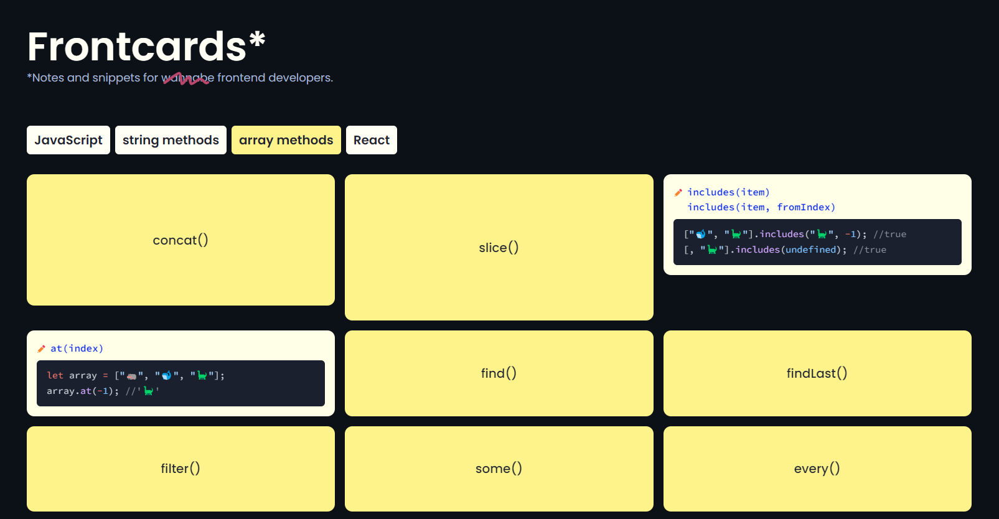

# Frontcards

I started this project as a small **JavaScript** exercise and a means to unclutter my frontend notes (see the [initial repo](https://github.com/double-vee/js-frontcards)).

Eventually, it turned into a **Next.js** exploration endeavor and a frontend learning tool that might be useful to aspiring developers.

The app renders a set of rotating cards for each selected frontend category. Each card shows a bunch of notes and/or code snippets.

Categories, notes and snippets will be subsequently added to the database.

## Built with

- React v18
- Next.js v14
- CSS modules
- [Bright](https://bright.codehike.org) (React Server Component for syntax highlighting)

## Screenshot

## Acknowledgments and sources

I took the notes while attending courses created by:

- [Scrimba](https://scrimba.com/allcourses?topic=react) teachers Cassidy Williams and Bob Ziroll,
- [Josh Comeau](https://courses.joshwcomeau.com),
- Shaun Pelling ([Net Ninja](https://netninja.dev/courses/)),
- Brad Traversy ([Traversy Media](https://www.traversymedia.com)),
- the frontend team at [InfoShare Academy](https://infoshareacademy.com).

Other sources include documentation and tutorials at:

- [MDN Web Docs](https://developer.mozilla.org) (obviously),
- [The Modern JavaScript Tutorial](https://javascript.info).

## Installation and setup

1. Make sure that `node` and `npm` are installed on your machine.
2. Clone the repo and jump to the project directory.
3. Run `npm install` to install dependencies.
4. Run the development server with `npm run dev`.
5. Open `http://localhost:3000` with your browser to see the result.
